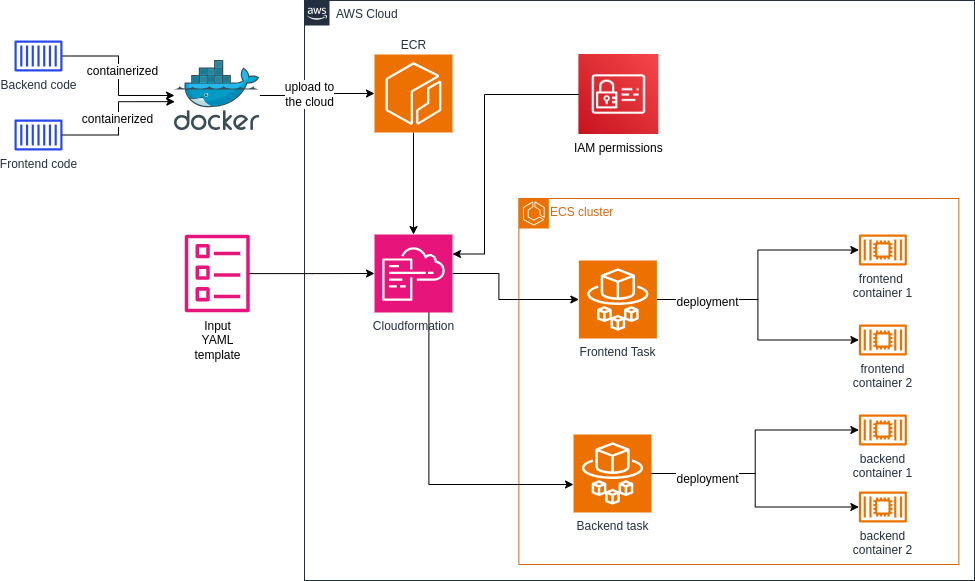

## Project Overview

This project demonstrates how to containerize multiple sample microservices and deploy them to the AWS Cloud using ECS (Elastic Container Service) with Fargate. The focus is on container orchestration and scalable deployments on AWS infrastructure, not the backend or frontend services.

## Architecture Diagram

The diagram below shows the design and the services used in the solution.

- **Microservices**: Example of two simple front and backend services, each running in its own Docker container.
- **AWS ECS (Fargate)**: Orchestrates containers launch.
- **AWS ECR**: Stores the microservices' Docker containers that will be pulled in ECS.
- **Networking**: Uses AWS VPC, subnets, security groups, and load balancers for secure communication between services.
- **CloudFormation**: AWS resources are provisioned and managed as code for reproducibility and easy automation of the infrastructure setup.

